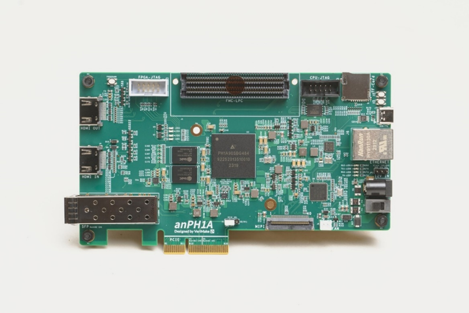
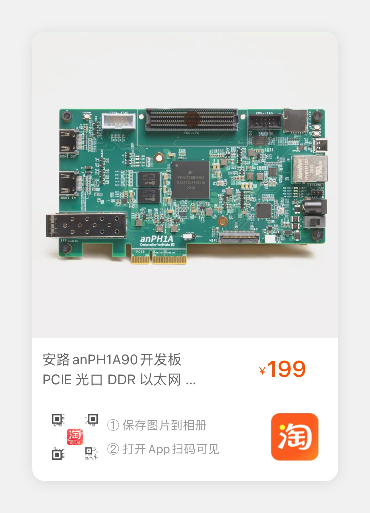

# 基于anPH1A开发板的语音识别SOC设计

## anPH1A开发板

### 开发板图片

### 购买链接

## 使用说明

- [Verimake论坛-基于anPH1A开发板的语音识别SOC设计](https://verimake.com/d/460-anph1asoc)

## 引脚分配

-  [Constrain/Speech_Rec.adc](./Constrain/Speech_Rec.adc)